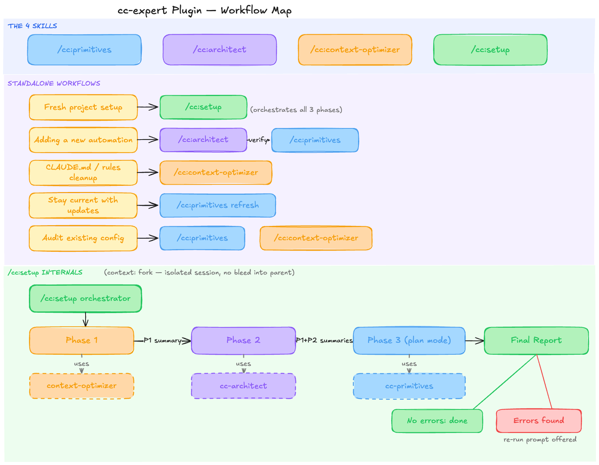
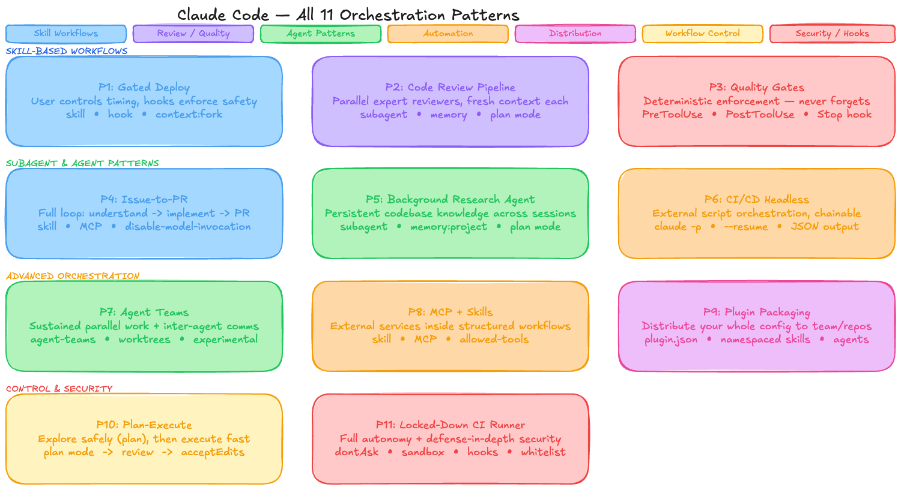

# ccx — Claude Code Expert Plugin

A Claude Code plugin that gives you four expert skills for building, designing,
and maintaining your Claude Code automation setup. Think of it as a second pair
of eyes that knows every frontmatter field, every anti-pattern, and every
workflow pattern — and keeps itself up to date as Claude Code ships new
features.



---

## Installation

```bash
claude plugin install ./cc-expert/
```

Or from a marketplace once published:

```bash
claude plugin install cc@your-marketplace
```

After installing, the four skills are available as:

| Command                 | What it does                                                 |
| ----------------------- | ------------------------------------------------------------ |
| `/cc:primitives`        | Schema reference + freshness check + project audit           |
| `/cc:architect`         | Automation designer — recommends primitives, scaffolds files |
| `/cc:context-optimizer` | Audits and optimizes CLAUDE.md and `.claude/rules/`          |
| `/cc:setup`             | Full setup wizard — foundation → design → validate           |

---

## Skills

---

### `/cc:primitives` — Schema Reference & Audit

**When to use:**

- You're writing a SKILL.md, agent .md, command .md, or hook and want to know
  the exact frontmatter fields
- You're auditing existing config files for errors or outdated patterns
- You want to know what's new in Claude Code since your last refresh
- You're unsure if a field you've seen is real or hallucinated

**What it does, step by step:**

**Step 1 — Freshness check** Every invocation starts by reading
`references/last-updated.txt`. This file stores the date and Claude Code version
of the last knowledge refresh:

```
date: 2026-03-12
version: 1.5.2
```

If the knowledge is ≤3 days old, it proceeds directly to answering. If it's
stale (>3 days), it proactively recommends a refresh before answering — because
Claude Code ships multiple times per week and frontmatter fields change. You can
also force an immediate refresh by saying "update", "refresh", or "what's new in
Claude Code".

For a precise signal beyond the date check, it can run:

```bash
npm view @anthropic-ai/claude-code version
```

...and compare against the stored version. If they differ, knowledge is stale
regardless of age.

**Step 2 — Refresh (when stale or requested)** Fetches 10 official doc pages
(`code.claude.com`) using both `web_fetch` and `web_search` (neither alone is
reliable — the site uses client-side rendering). Pages covered: skills, slash
commands, subagents, memory & rules, hooks reference, hooks guide, settings,
plugins, plugins reference, output styles.

Then fetches the changelog — but only entries since the stored version, using:

```bash
VER=$(grep '^version:' references/last-updated.txt | cut -d' ' -f2 || echo "NOMATCH")
curl -s "https://raw.githubusercontent.com/anthropics/claude-code/main/CHANGELOG.md" \
  | sed "/^## ${VER}$/q"
```

`sed` stops at your stored version's header — you only get new entries, not the
full file. If the version isn't found (pruned from history, corrupt file), the
guard returns the full changelog safely.

Then it audits your existing Claude Code config files — across all three
locations:

```bash
# Project-level
find .claude/ -type f \( -path "*/skills/*/SKILL.md" -o -path "*/agents/*.md" \
  -o -path "*/commands/*.md" -o -path "*/rules/*.md" \
  -o -name "settings.json" -o -name "plugin.json" \) 2>/dev/null

# User-level
find ~/.claude/ -type f \( -path "*/skills/*/SKILL.md" -o -path "*/agents/*.md" \
  -o -path "*/commands/*.md" -o -path "*/plugins/*/plugin.json" \) 2>/dev/null

# Personal dotfiles
find ~/.dotfiles/claude/ -type f \( -path "*/skills/*/SKILL.md" -o -path "*/agents/*.md" \
  -o -path "*/commands/*.md" -o -path "*/plugins/*/plugin.json" \
  -o -name "settings.json" \) 2>/dev/null
```

Each file is checked for: schema errors (invalid fields, wrong primitive type),
changelog upgrade opportunities (new fields that apply to this file), and known
anti-patterns. Findings are reported as 🔴 Errors / 🟡 Upgrades / 🔵
Suggestions.

Finally, writes the refreshed date and latest version back to
`last-updated.txt`.

**Step 3 — Answer** Reads `references/schemas.md` (a compiled reference of all
primitive schemas) and answers with: the complete field table, required vs
optional, gotchas, and a minimal working example. If the question isn't covered
by the local reference, falls back to fetching the live doc page — never guesses
from training data.

**Example interactions:**

```
What frontmatter fields does a subagent support?
→ Returns complete agent .md schema from references/schemas.md

Does context: fork work in slash commands?
→ No — explains that context: fork is a skill-only field

Audit my Claude Code setup
→ Scans project + user + dotfiles dirs, reports all findings
```

---

### `/cc:architect` — Automation Designer



**When to use:**

- You know _what_ you want to automate but not _which Claude Code primitive_ to
  use
- You're not sure whether your use case needs a skill, a hook, a subagent, or
  all three
- You want scaffold files written to disk — not just advice
- You want to catch anti-patterns before you build

**What it does, step by step:**

**Step 1 — Intake** Reads your description and extracts the key classification
axes:

- What triggers it? (user types a command, model decides autonomously, file
  changes, CI, schedule)
- What does it do? (read-only research, writes files, external side effects like
  deploys/messages)
- Does it need isolated context from the main session?
- Is it a one-off or a repeatable workflow?
- Does it need external services (GitHub, Sentry, databases)?
- Should it be distributed to your team?

If critical axes are still ambiguous after reading, asks at most 3 targeted
questions — only the ones that actually change the recommendation.

**Step 2 — Classify** Walks the decision tree in `references/decision-tree.md`
against your answers. Identifies:

- **Primary primitive** — the one that does the core work
- **Composites** — additional primitives that harden the design (e.g., a hook
  guarding a skill)
- **Pattern match** — which of the 13 workflow patterns in
  `references/patterns.md` is closest
- **Anti-patterns triggered** — checks all 9 anti-patterns against your
  described approach

**Step 3 — Recommend** Presents the recommendation in a structured format:

```
## Recommendation: Skill + PreToolUse Hook
Pattern match: Pattern 1 — Gated Deployment Skill

### Why this, not X
### What you're getting
### ⚠️ Anti-patterns to avoid
### Tradeoffs
```

If two approaches are genuinely close, presents both with a scored comparison
and asks you to pick before writing anything.

**Step 4 — Scaffold** Asks for your project root (or uses the path you already
mentioned), then writes all required files. Cross-checks every frontmatter field
against `references/schemas.md` directly via the Read tool — does not rely on
training data.

Files are written to the correct location depending on scope:

| Primitive       | Project-level                 | User-level                      | Personal dotfiles                            |
| --------------- | ----------------------------- | ------------------------------- | -------------------------------------------- |
| Skill           | `.claude/skills/<n>/SKILL.md` | `~/.claude/skills/<n>/SKILL.md` | `~/.dotfiles/claude/skills/<n>/SKILL.md`     |
| Slash command   | `.claude/commands/<n>.md`     | `~/.claude/commands/<n>.md`     | `~/.dotfiles/claude/commands/<n>.md`         |
| Subagent        | `.claude/agents/<n>.md`       | `~/.claude/agents/<n>.md`       | `~/.dotfiles/claude/agents/<n>.md`           |
| Rule            | `.claude/rules/<n>.md`        | —                               | —                                            |
| Hook (project)  | `.claude/settings.json`       | `~/.claude/settings.json`       | —                                            |
| Plugin manifest | `.claude-plugin/plugin.json`  | —                               | `~/.dotfiles/claude/plugins/<n>/plugin.json` |

Each generated file has:

- Every required frontmatter field filled in
- Optional fields commented out with sensible defaults shown
- A starter body reflecting your actual use case (not a generic template)
- `# TODO:` markers where you need to fill in specifics

For hook scripts: writes both the `.sh` file and the `settings.json` entry, and
runs `chmod +x` on the script.

**Step 5 — Next steps** After scaffolding, tells you: what to fill in (the
TODOs), any permissions or tool installs needed, how to test it, and what Stage
N+1 looks like for your setup.

**Example interactions:**

```
I want a command that deploys to staging and production
→ Recommends Skill with disable-model-invocation: true + context: fork + PreToolUse hook
→ Asks: project root?
→ Writes: .claude/skills/deploy/SKILL.md + .claude/hooks/validate-deploy.sh + settings.json entry

I want Claude to auto-format files after every edit
→ Recommends PostToolUse hook on Write|Edit
→ Writes: settings.json hook entry + .claude/hooks/auto-format.sh

Should I use a skill or a slash command for my commit message helper?
→ Walks the decision tree, asks: does the model need to invoke it autonomously?
→ If yes → skill. If user-only → slash command or skill with disable-model-invocation: true
```

---

### `/cc:context-optimizer` — CLAUDE.md & Rules Optimizer

**When to use:**

- Your CLAUDE.md has grown bloated or contradictory
- You want to restructure `.claude/rules/` for better signal-to-noise
- After a long session with new patterns discovered, you want to capture them
  properly
- You want to audit context files against ACE (Agentic Context Engineering)
  principles

This skill applies research-backed principles from ACE and empirical studies on
AGENTS.md effectiveness. It keeps context files minimal, non-redundant, and
high-signal.

Also used internally by `/cc:setup` Phase 1 via the `ccx-setup-context`
subagent.

---

### `/cc:setup` — Full Setup Wizard

**When to use:**

- Starting a new project's Claude Code configuration from scratch
- Doing a full audit and upgrade of an existing setup
- Onboarding a new repo to your team's Claude Code conventions

> ⚠️ This skill uses `context: fork` — it runs in an isolated subagent context.
> Your main session stays clean. It reports a summary when done.

**This skill is `disable-model-invocation: true`** — you must trigger it
explicitly with `/cc:setup`. Claude will never run it autonomously.

**What it does, step by step:**

Orchestrates three specialist subagents sequentially. Each phase depends on the
previous — they do not run in parallel.

**Phase 1 — Foundation (`ccx-setup-context` subagent)** Uses the
`context-optimizer` skill to build or audit your CLAUDE.md and `.claude/rules/`.

What it produces:

- A properly structured CLAUDE.md (project overview, build commands,
  architecture, conventions) kept under 200 lines — workflow content goes to
  skills, not here
- Domain-specific rule files in `.claude/rules/` (e.g., `testing.md`,
  `api-design.md`, `security.md`) with `paths:` frontmatter so they only load
  when relevant files are accessed
- A summary of everything created or changed

**Phase 2 — Design & Scaffold (`ccx-setup-architect` subagent)** Uses the
`ccx-architect` skill, pre-loaded with the Phase 1 output, to design and
scaffold your automation primitives.

What it receives: the Phase 1 summary (what conventions now exist) + your
automation goals.

What it produces:

- Recommended primitives for each goal (skills, subagents, hooks, commands)
- All scaffold files written to disk with correct schemas
- `# TODO:` markers for specifics you need to fill in
- A summary of all files created with their paths

**Phase 3 — Validate (`ccx-setup-validator` subagent)** Uses the
`ccx-primitives` skill in `permissionMode: plan` (read-only) to validate
everything.

What it receives: project root + Phase 1 summary + Phase 2 summary (both, so
CLAUDE.md and rules are validated alongside the scaffolded primitives).

What it checks:

- 🔴 **Errors** — invalid frontmatter fields, wrong primitive type, schema
  violations that will silently break behavior
- 🟡 **Upgrades** — new Claude Code features from the changelog that apply to
  your files
- 🔵 **Suggestions** — anti-patterns, style improvements

**Final Report** Synthesizes all three phases:

```
## ✅ Phase 1 — Foundation
<what context-optimizer created or changed>

## ✅ Phase 2 — Design & Scaffold
<what ccx-architect scaffolded, with file paths>

## Phase 3 — Validation
<🔴 errors / 🟡 upgrades / 🔵 suggestions>

## TODO markers
<all # TODO: items across all generated files, grouped by file>

## Next upgrade
<what Stage N+1 looks like for this project>
```

**If 🔴 errors are found**, the wizard does NOT attempt to fix them in the
current session (the forked context has ended and the subagents are gone).
Instead it provides a pre-composed re-run prompt you can paste directly:

```
⚠️ Validation found 2 error(s):

  .claude/agents/reviewer.md — unknown field "context" (context: fork is skill-only)
  .claude/skills/deploy/SKILL.md — missing required field "name"

To fix and re-validate, run /cc:setup with this context:
  "Re-running setup to fix validation errors from previous run:
   [error list]
   Project root: ./. Skip Phase 1. Focus Phase 2 on fixing only the flagged files.
   Re-run Phase 3 to confirm."
```

**Example interactions:**

```
/cc:setup
→ "Where is your project root?"
→ Runs Phase 1: creates CLAUDE.md + rules/
→ "What workflows do you want to automate?" (from architect subagent)
→ Runs Phase 2: scaffolds skills/agents/hooks
→ Runs Phase 3: validates everything
→ Final report with TODOs and next upgrade path

/cc:setup  (on an existing project)
→ Reads existing CLAUDE.md and rules — updates rather than overwrites
→ Audits existing skills/agents for schema errors and upgrade opportunities
→ Proposes new primitives for automation gaps
→ Validates the full setup
```

---

## Suggested Workflow

**Starting fresh:**

```
1. /cc:setup               → foundation (context-optimizer) + scaffold + validate in one pass
2. Fill in # TODO: markers in generated files
3. /cc:primitives          → verify schemas are correct
```

**Adding a specific automation:**

```
1. /cc:architect           → design + scaffold the new primitive
2. /cc:primitives          → verify the schema of the generated file
```

**CLAUDE.md getting bloated or messy:**

```
1. /cc:context-optimizer   → audit + restructure CLAUDE.md and .claude/rules/
                             → applies ACE principles, removes redundancy, adds paths: frontmatter
                             → can also capture patterns discovered in the current session
```

**Staying current with Claude Code updates:**

```
1. /cc:primitives refresh  → fetches latest docs + changelog, audits your setup
                             → reports 🟡 upgrades you can apply
```

**Auditing an existing project:**

```
1. /cc:primitives audit my setup
   → scans .claude/, ~/.claude/, ~/.dotfiles/claude/
   → reports errors, upgrades, suggestions across all your primitives

2. /cc:context-optimizer audit my context
   → focused audit of CLAUDE.md and rules only
   → deeper analysis using ACE research + audit-checklist
```

**How the skills relate:**

```
/cc:context-optimizer  ←──── used by ────→  /cc:setup Phase 1
      ↓                                            ↓
  standalone CLAUDE.md               full project setup wizard
  + rules optimization                (foundation → scaffold → validate)

/cc:architect  ←──────────── used by ────→  /cc:setup Phase 2
      ↓
  standalone primitive
  design + scaffold

/cc:primitives  ←─────────── used by ────→  /cc:setup Phase 3
      ↓
  standalone schema
  reference + audit
```

All four skills are independently useful. `/cc:setup` is the orchestrator that
sequences the other three for a complete project setup in one pass.

---

## File Layout

```
cc-plugin/
├── README.md                          ← you are here
├── .claude-plugin/
│   └── plugin.json                    ← manifest
├── skills/
│   ├── primitives/
│   │   ├── SKILL.md                   ← /cc:primitives
│   │   └── references/
│   │       ├── schemas.md             ← compiled frontmatter schema reference
│   │       └── last-updated.txt       ← date + version of last refresh
│   ├── context-optimizer/
│   │   ├── SKILL.md                   ← /cc:context-optimizer
│   │   └── references/
│   │       ├── research-summary.md    ← ACE research + AGENTS.md studies
│   │       ├── claude-md-template.md  ← canonical CLAUDE.md structure
│   │       ├── audit-checklist.md     ← checklist for auditing context files
│   │       └── restructure-guide.md   ← how to restructure rules/
│   ├── architect/
│   │   ├── SKILL.md                   ← /cc:architect
│   │   └── references/
│   │       ├── decision-tree.md       ← 7-axis classification + primitive selection logic
│   │       ├── patterns.md            ← 13 workflow patterns with trigger signals
│   │       └── anti-patterns.md       ← 9 anti-patterns with detection signals + fixes
│   └── setup/
│       └── SKILL.md                   ← /cc:setup (orchestrator)
└── agents/
    ├── ccx-setup-context.md            ← Phase 1 subagent (uses context-optimizer skill)
    ├── ccx-setup-architect.md          ← Phase 2 subagent (uses ccx-architect skill)
    └── ccx-setup-validator.md          ← Phase 3 subagent (uses ccx-primitives skill)
```

---

## Personal Dotfiles Convention

This plugin is aware that personal Claude Code config lives in
`~/.dotfiles/claude/` rather than `~/.claude/`. The audit scan in
`/cc:primitives` and the scaffold table in `/cc:architect` both cover this path.
If your dotfiles structure is different, update the `find` commands in
`skills/primitives/SKILL.md` Step 2c.

---

## Updating the Schema Reference

The compiled schema in `skills/primitives/references/schemas.md` is seeded from
official docs at build time. It stays fresh automatically via
`/cc:primitives refresh`, which fetches the latest docs and changelog and writes
the current version to `last-updated.txt`.

Run `/cc:primitives refresh` after install to pull the actual current state.

---

## Sources

All schema knowledge is sourced exclusively from official Anthropic
documentation:

- [Skills](https://code.claude.com/docs/en/skills)
- [Slash commands](https://code.claude.com/docs/en/slash-commands)
- [Subagents](https://code.claude.com/docs/en/sub-agents)
- [Hooks reference](https://code.claude.com/docs/en/hooks)
- [Hooks guide](https://code.claude.com/docs/en/hooks-guide)
- [Memory & rules](https://code.claude.com/docs/en/memory)
- [Settings](https://code.claude.com/docs/en/settings)
- [Plugins](https://code.claude.com/docs/en/plugins)
- [Plugins reference](https://code.claude.com/docs/en/plugins-reference)
- [Output styles](https://code.claude.com/docs/en/output-styles)
- [Changelog](https://github.com/anthropics/claude-code/blob/main/CHANGELOG.md)
